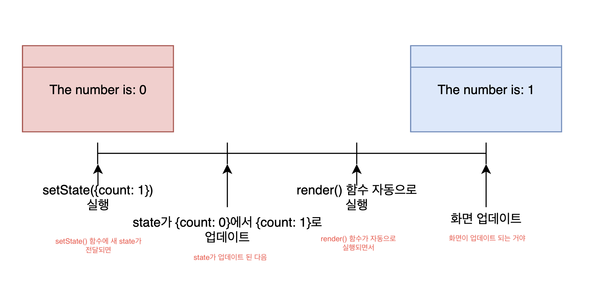

# **Do it! 클론 코딩 영화 평점 웹 서비스**
* Mobile-X 연구실  
2020년 3학년 1학기 하계 방학 세미나 프로젝트

---
## **목차**   
* [Ch_01 - 안녕 리액트?](#Ch_01)   
    * 01-1 클론 코딩 수업 준비하기
    * 01-2 왜 리액트일까?
    * 01-3 무엇을 클론 코딩할까?

* [Ch_02 - 리액트로 클론 코딩 시작하기](#Ch_02)
    * 02-1 슈퍼 빠른 create-react-app
    * 02-2 깃허브에 리액트 앱 업로드하기
    * 02-3 리액트 앱 살펴보고 수정하기
    * 02-4 리액트 동작 원리 알아보기

 * [Ch_03 - 리액트로 기초 개념 알아보기](#Ch_03)
    * 03-1 리액트 앱 실행 복습하기
    * 03-2 첫 번째 리액트 기초 개념: 컴포넌트
    * 03-3 두 번째 리액트 기초 개념: JSX
    * 03-4 세 번째 리액트 기초 개념: props

* [Ch_04 - 슈퍼 똑똑하게 컴포넌트 만들기](#Ch_04)
    * 04-1 비슷한 컴포넌트 여러 개 만들기
    * 04-2 map() 함수로 컴포넌트 많이 만들기
    * 04-3 음식 앱 이리저리 만지고, 고쳐보기
    * 04-4 음식 앱에 prop-types 도입하기

* [Ch_05 - state와 클래스형 컴포넌트](#Ch_05)
    * 05-1 state로 숫자 증감 기능 만들어 보기
    * 05-2 숫자 증감 기능을 제대로 만들어 보기
    * 05-3 클래스형 컴포넌트의 일생 알아보기
    * 05-4 영화 앱 만들기 워밍업

* [Ch_06 - 영화 앱 만들기](#Ch_06)
    * 06-1 영화 API 사용해 보기
    * 06-2 영화 데이터 화면에 그리기
    * 06-3 Movie 컴포넌트 만들기
    * 06-4 영화 앱 스타일링 하기 - 기초

* [Ch_07 - 영화 앱 다듬기](#Ch_07)
    * 07-1 영화 앱 전체 모습 수정하기
    * 07-2 영화 앱 멋지게 스타일링하기
    
* [Ch_08 - 영화 앱 만들기](#Ch_08)
    * 08-1 react-router-dom 설치하고 프로젝트 폴더 정리하기
    * 08-2 라우터 만들어 보기
    * 08-3 내비게이션 만들어 보기
    * 08-4 영화 상세 정보 기능 만들어 보기
    * 08-5 리다이렉트 기능 만들어 보기    
---
<a id = "Ch_01"></a>

## **Ch_01-안녕 리액트?**
* 클론 코딩 수업 준비하기
    1. Node.js 설치하기   
        [Node.js 설치 페이지 바로 이동](https://nodejs.org/ko/download/)

        ``` 
        > node -v  
        v12.16.1
        ```

        * Node.js란…? (Node.js 공식 사이트에서 내린 Node.js의 정의)   
            
                Node.js는 Chrome V8 JavaScript 엔진으로 빌드된 JavaScript 런타임임  
            
                Node.js는 이벤트 기반, 논 블로킹 I/O 모델을 사용해 가볍고 효율적임   
            
                Node.js의 패키지 생태계인 npm은 세계에서 가장 큰 오픈 소스 라이브러리 생태계임
            
            >(Node.js는 백엔드 영역이라는 말은 오해!!   
            Node.js를 통해서 서버도 만들수 있기 때문에 생겨난 오해라고 함)

            * Node.js가 사용되는 분야   
                * 입출력이 잦은 어플리케이션
                * 데이터 스트리밍 어플리케이션
                * 데이터를 실시간으로 다루는 어플리케이션
                * JSON API 기반 어플리케이션
                * [싱글페이지](https://junsday.tistory.com/40) 어플리케이션(SPA = Single Page Application)   
                    - 단일 페이지 어플리케이션으로 정적파일을 한번에(나눠서도 가능) 모두 다운받고 이후 사용자와의 상호작용 가운데 필요한 데이터만 서버에서 (비동기)동적으로 받게 해 트래픽의 총량을 줄이는 어플리케이션 형태.   
                    웹의 사용성(UX), 속도 향상의 이점을 가지므로 모바일 퍼스트(Mobile Firtst) 전략에 부합.    
                    웹 페이지이나 데스크탑 어플리케이션 처럼 동작하는 웹 페이지


    2. npm 설치하기
        * Node.js를 설치하면 노드 패키지 매니저(이하 npm)도 함께 설치 됨
        ``` 
        > npm -v 
        6.13.4
        ```   

        * [npm(Node Packaged Manager) 이란?](https://m.blog.naver.com/magnking/220961896609)
            * Node.js로 만들어진 모듈을 웹에서 받아서 설치하고 관리해주는 프로그램

        * 패키지 매니저의 예시들
            * Python: pip
            * Java: jpm
            * Javascript: npm

    3. npx 설치하기
        ``` 
        > npm install npx -g
        생략...
        + npx@10.2.2
        added 293 packages from 654 contributors in 11.548s
        > npx -v
        6.13.4
        ``` 
        * [npx란?](https://geonlee.tistory.com/32)
            * 자바스크립트 패키지 관리 모듈인 npm(Node Package Module)의 npm@5.2.0 버전부터 새로 추가된 도구.  
            * 따라서 npm@5.2.0 이상 버전만 깔려 있다면 npx 커맨드 사용 가능
            * npm 레지스트리의 패키지 사용 경험을 파악하기 위한 도구 -npm은 레지스트리에서 호스팅 되는 종속성을 매우 쉽게 설치하고 관리할 수 있으며, npx는 레지스트리에서 호스팅되는 CLI(Command Line Interface) 도구 및 기타 실행 파일을 쉽게 사용할 수 있음. 
                * [CLI(Command Line Interface)란?](https://medium.com/@psychet_learn/cli-cli-%EA%B8%B0%EB%B3%B8-%EA%B0%9C%EB%85%90-%EB%B0%8F-%EC%82%AC%EC%9A%A9%EB%B2%95-c8d000ebc162)
                > 명령 줄 인터페이스또는 명령어 인터페이스 즉 텍스트 터미널을 통해 사용자와 컴퓨터가 상호 작용하는 방식을 말함.
            * 지금까지 일반적인 npm과 관련하여 약간의 귀찮은 과정들이 필요했던 여러가지 사항을 크게 단순화함.

    4. [VSCode 설치하기](https://code.visualstudio.com/)
        * 편리한 작업 환경을 제공해줌.

    5. git 설치하기
    ``` 
    > git --version
    git version 2.26.0.windows.1
    ``` 
    * [git이란?](https://goddaehee.tistory.com/91)
        * [git 한글 공식 메뉴얼](https://git-scm.com/book/ko/v2)
---
<a id = "Ch_02"></a>

## **Ch_02-리액트로 클론 코딩 시작하기**
1. 슈퍼 빠른 create-react-app
    * create-react-app으로 리액트 앱 만들기
        ``` 
         > npx create-react-app movie_app_2020
         Success! Create movie_app_2020 at C:\movie_app_2020
         Inside that directory, you can run several commands:
     
         npm start 
           Starts the development server.
        (생략...)
         ``` 

        * 참고: [터미널 명령어](https://m.blog.naver.com/PostView.nhn?blogId=thdbsgh3443&logNo=221286374424&proxyReferer=https:%2F%2Fwww.google.com%2F)(아무것도 모른다면 터미널 사용이 어려울 수 있음)

    * npx는 create-react-app을 다운로드 한 다음 create-react-app movie_app_2020 명령어를 실행하여 리액트 앱을 생성해줌.

    * 리액트 앱 실행하기
         ``` 
         > npm start
         Compiled succesfully!
     
         You can now view movie_app_2020 in the browser.
            Local:              http://localhost:3000
            On Your Network     http://192.168.0.192:3000
         ```    

            

    * 리액트 앱 종료하기
        * 리액트 앱의 종료는 명령 프롬프트(터미널)에서 Ctrl + C를 누르면 됨.

2. 깃허브에 리액트 앱 업로드 하기
    * 로컬 저장소 초기화 하기
        * 터미널에서 루트 폴더로 이동한 후 다음 명령어를 입력
            ``` 
            > git init
            Initalized empty Git repository in C:/movie_app_2020/.git/
            또는
            Reinitialized existing Git repository in C:/movie_app_2020/.git/
            ```   
    * 깃허브에 저장소 만들기
    * 깃허브 저장소에 리액트 앱 업로드하기
        ``` 
        > git remote add origin github.com/[계정 이름]/movie_app_2020.git
        ```   
    * 리액트 앱 업로드
        ``` 
        > git add .
        > git commit -m "02-2 깃허브에 리액트 앱 업로드하기"
        > git push origin master
        Enumerating objects: 23, done.
        Counting objects: 100% (23/23), done.
        (생략...)
        To https://github.com/[계정 이름]/movie_app_2020
        ```   
3. 리액트 앱 살펴보고 수정하기

4. 리액트 동작 원리 알아보기
       
    * App.js, index.js 등에 있는 파일을을 리액트가 받아와서 해석하고 만든 결과물을 index.html에 끼워 넣음.   
    (따라서 <dive id = "root"> 와 </div> 사이가 비어 있게 됨   
    즉 리액트는 index.html의 <dive id = "root"> 와 </div> 중간에 넣을 결과물을 프로젝트 폴더에 있는 파일(App.js, ...)을 해석하여 만들어 넣는 역할을 담당)    
    
    1. index.js 살펴보기

        ```js
        ReactDom.render(<App />, document.getElementById('root'));
        ```   
        > 이 코드가 App.js 파일에 작성한 코드를 index.html의 아이디가 'root'인 엘리먼트에 넣어주는 것
    
    2. index.html 수정해보기   
    * index.html 파일을 열어서 `<div id="root"></div>` 을 `<div id="potato"></div>`로 바꿔보자

        ```html
        <body>
             <noscript> You need to enable JavaScript to run this app. </noscript>
             <div id="potato"></div>
             (생략...)
        </body>
        </html>
        ```  
        > 아이디가 "potato"로 바뀌어 앱이 실행되지 않음.

        ```js
        ReactDom.render(<App />, document.getElementById('potato'));
        ```   
        > 이와 같이 수정하였을 경우에는 다시 작동 됨.

    ---    
    
<a id = "Ch_03"></a>

## **Ch_03 - 리액트로 기초 개념 알아보기**
1. 리액트 앱 실행 복습하기

2. 첫 번째 리액트 기초 개념: 컴포넌트
    1. App.js 파일로 컴포넌트의 정의 알아보기
        * App.js 파일을 열고 App() 함수와 App() 함수가 반환하는 값을 보자

        ```js
        import React from 'react';

        function App(){
            return (
                <div>
                    <h1>Hello</h1>
                </div>
            );
        }

        export default App;
        ```   
        > App() 함수가 정의되어 있고, 이 함수가 `<div><h1>Hello</h1></div>`를 반환 함.   
          이것이 바로 App 컴포넌트 정의.    
          App() 함수가 반환한 HTML이 리액트 앱 화면에 그려지는 것임.
        
    2. index.js 파일로 컴포넌트의 사용 알아보기
        ```js
        import React from 'react';
        import ReactDOM from 'react-dom';
        import App from './App';                                  //App 컴포넌트를 임포트하여 사용

        ReactDOM.render(<App />, document.getElementById('root')); //App 컴포넌트를 임포트하여 사용
        ```   
        > App 컴포넌트 생김새가 마치 HTML 태그 같으나 HTML에는 그러한 태그는 없음.       
          <App />을 ReactDOM.render() 함수의 첫번째 인자로 전달하면 App 컴포넌트가 반환하는 것들을 화면에 그릴 수 있음.    
          App 컴포넌트가 그려질 위치는 ReactDOM.render() 함수의 두 번째 인자로 전달하면 됨.   
          함수를 그대로 해석해서 **'App 컴포넌트는 아이디가 root인 엘리먼트에 그려질 것이다.'** 정도로 이해하면 됨.  
          아이디가 root인 엘리먼트는 index.html에 있음.

           

        > 리액트는 ` <App />` 과 같은 표시를 컴포넌트로 인식하고, 그 컴포넌트가 반환하는 값을 화면에 그려줌.   
        따라서 컴포넌트를 사용할 때 ` <App />` 이 아닌 ` App` 이라고 입력하면 오루가 발생함.   
        **(중요!!: 리액트는 컴포넌트와 함께 동작하고, 리액트 앱은 모두 컴포넌트로 구성됨)**
    
    3. 두 번째 리액트 기초 개념: JSX
        * 컴포넌트 = JSX(자바스크립트 + HTML 조합) 이라는 문법을 사용

        1. Potato 컴포넌트 만들기
            ```js
            import React from 'react';
            function Potato(){  //기본적인 Potato 컴포넌트 틀   
                                //(항상 컴포넌트 이름은 대문자!)
            }
            ```     
        > **주의!: 컴포넌트 이름은 항상 대문자 이어야 함!!!!!!**

        2. 다음을 참고하여 Potato 컴포넌트가 JSX를 반환하도록 해보자
             ```js
            import React from 'react';
            function Potato(){  //기본적인 Potato 컴포넌트 틀   
                                //(항상 컴포넌트 이름은 대문자!)
                return <h3> I love potato </h3>; //HTML이 아닌 JSX임
            }
            ```   
        > **주의!: return 문에 있는 것은 HTML이 아닌 JSX!!**

        3. 마지막 줄에 export default Potato; 추가
            ```js
            import React from 'react';
            function Potato(){  //기본적인 Potato 컴포넌트 틀   
                                //(항상 컴포넌트 이름은 대문자!)
                return <h3> I love potato </h3>; //HTML이 아닌 JSX임
             }

            export default Potato;
            ```   
            > export default Potato;를 추가하면 다른 파일에서 Potato 컴포넌트를 사용 가능.

        4. Potato 컴포넌트 사용하기
            ```js
            import React from 'react';
            import ReactDOM from 'react-dom';
            import App from './App';
                
            ReactDOM.render(<App /><Potato />, document.getElementById('root'));
            ```   
            > 위와 같이 수정 했을 경우에는 오류가 발생!!   
              **오류: Adjacent JSX elements must be wrapped in an enclosing tag**   
              **(인접한 JSX 요소는 반드시 하나의 태그로 감싸야 한다.)**   
              리액트는 최종적으로 단 한개의 컴포넌트를 그려야 하는데 지금은 두개의 컴포넌트를 그리려고 해서 오류가 발생.   
              **해결 방법: Potato 컴포넌트를 App 컴포넌트 안에 넣어야 한다.**
        
        5. App 컴포넌트에 Potato 컴포넌트 임포트하기
            ```js
            import React from 'react';
            import Potato from './Potato';       // ./는 현재 파일이 있는 폴더를 말함
                                                 // ../는 현재 파일의 상위 폴더를 말함
            function App(){
                return (
                    <div>
                        <h1>Hello</h1>
                        <Potato />
                    </div>
                    );
                }
            export default App;
            ```       
            

            > 크롬 개발자 도구를 실행하여 [Element] 탭을 열어 코드를 살펴보면 리액트가 `<Poatao />` 를 해석해서 `<h3> I love potato </h3>` 로 만든것을 확인 할 수 있음 
            (-> 이것이 JSX가 리액트에서 동작하는 방식임    
                    = 컴포넌트는 JSX로 만들고 JSX는 자바스크립트와 HTML을 조합한 문법)

            6. App 컴포넌트 안에 Potato 컴포넌트 만들기
                ```js
                import React from 'react';
                                                     
                function Potato(){                        //Potato 컴포넌트를 만듬.
                    return <h1> I like potato </h1>;
                }

                function App(){
                    return (
                        <div>
                            <h1>Hello</h1>
                            <Potato />                   //Potato 컴포넌트를 가져와서 사용
                        </div>
                    );
                }
                export default App;
                ```  
3. [세 번째 리액트 기초 개념: props](https://ko.reactjs.org/docs/components-and-props.html)
    * props란? 
        > 컴포넌트에서 컴포넌트로 전달하는 데이터를 말함.   
          함수의 매개 변수와 같이 함수를 효율적으로 재사용할 수 있는 것과 같음.
    
    1. 컴포넌트 여러개 사용해보기 
        ```js
        import React from 'react';

        function Movie(){                        //Movie 컴포넌트를 만듬. 정의할 때 이름과
            return <h1> I like potato </h1>;
        }

        function App(){
            return (
                <div>
                    <h1>Hello</h1>
                    <Movie />                   //컴포넌트를 사용 할 때의 이름을 모두 바꿔야함.
                </div>
            );
        }
        export default App;
        ```
        > 여기서 영화 목록을 20개 만들고 싶다면? 
          Movie 컴포넌트를 20개 복사하여 붙여 넣는 방법 (매우 비효율적이네;;)

    * 이러한 문제를 해결하고자 props가 등장!

    2. props로 컴포넌트에 데이터 전달하기
        ```js
        import React from 'react';

        function Food(){                        
            return <h1> I like potato </h1>;
        }

        function App(){
            return (
                <div>
                    <h1>Hello</h1>
                    <Food fav="kimchi" />       //fav는 favorite의 줄임말.
                </div>
            );
        }
        export default App;
        ```
        > Food 컴포넌트에 사용한 props의 이름은 fav이고, fav에 "kimchi"라는 값을 담아 Food 컴포넌트에 보냄.   
          props에는 불리언 값(true, false), 숫자, 배열과 같은 다양한 형태의 데이터를 담을 수 있음.   
          **주의!: props에 있는 데이터는 문자열인 경우를 제외하면 모두 중괄호({})로 감싸야함.**

        ```js
        (생략...)
            <Food fav="kimchi" something={true} papapapa={['hello', 1, 2, 3, 4, true]} /> 
        (생략...)
        ```   
        > 이런식으로 문자는 "" 나머지는 {}로 둘러싸여 있음.    
          여기까지의 코드를 다시 실행 시켜보면 아직까지 아무런 변화가 없음.   
        >    > Food 컴포넌트에 props 보내기만 했을 뿐 아직 사용하지 않았기 때문임.

    3. props 사용하기
        ```js
        import React from 'react';

        function Food(props){
            console.log(props)                        
            return <h1> I like potato </h1>;
        }

        function App(){
            return (
                <div>
                    <h1>Hello</h1>
                    <Food fav="kimchi"something={true} papapapa={['hello', 1, 2, 3, 4, true]} /> 
                </div>
            );
        }
        export default App;
        ```
        > 아직까지도 리액트 앱 화면에서는 아무런 변화가 없다.   
        >    > console.log()함수는 개발자 도구의 [Console]탭에만 영향을 주기 때문.

        

    4. props 다시 한 번 사용하기
        ```js
        import React from 'react';

        function Food(props){              
            return <h1> I like {props.fav} </h1>;
        }

        function App(){
            return (
                <div>
                    <h1>Hello</h1>
                    <Food fav="kimchi"/> 
                </div>
            );
        }
        export default App;
        ```
        
        > 결과는 이렇게 나온다.   
          **Food 컴포넌트에 props에 있는 데이너 "kimchi"를 화면에 출력하려면 props.fav를 중괄호로 감싸서 사용하면 됨.**

    5. [구조 분해 할당](https://ko.javascript.info/destructuring-assignment)으로 props 사용하기
        ```js
        function Food(props){ 
            {fav} = props;             
            return <h1> I like {fav} </h1>;
        }
        ---------------------------------------------------
       function Food({fav}){              
            return <h1> I like {fav} </h1>;
        }
        ```
        > 자바스크립트 ES6의 문법 중 구조 분해 할당(destructuring-assignment)을 사용하면 점 연산자를 사용하지 않아도 됨.   
        위 두 문법 중 어느 방법이든 사용해도 된다. 

    6. 여러개의 컴포넌트에 props 사용하기
        ```js
        import React from 'react';

        function Food({fav}){              
            return <h1> I like {fav} </h1>;
        }

        function App(){
            return (
                <div>
                    <h1>Hello</h1>
                    <Food fav="kimchi"/>
                    <Food fav="ramen"/>
                    <Food fav="samgiopsal"/>
                    <Food fav="chukumi"/> 
                </div>
            );
        }
        export default App;
        ```
        
        > Food 컴포넌트를 4개 사용하여 각 컴포넌트에 전달한 fav props를 출력.   
          각각의 fav props에는 서로 다른 값이 들어가 있어 같은 컴포넌트를 사용해도 서로 다른 문장이 출력됨.   
          **이와 같은 상황을 컴포넌트를 재사용 했다고 부름.**

    * 3장에서 배운 내용 요약
    > **(1)** 컴포넌트가 무엇인지를 알아고보 JSX를 공부했다.   
      **(2)** JSX는 단지 HTML과 자바스크립트를 조합한 문법이다.   
      **(3)** JSX를 이용해서 컴포넌트를 작성했으며 컴포넌트의 이름은 **대문자**로 시작해야함.   
      **(4)** 컴포넌트에 데이터를 전달할 때는 props를 사용하면 된다.   
        &nbsp;&nbsp;&nbsp;&nbsp;&nbsp;&nbsp;&nbsp;컴포넌트에 props를 전달하면 props에 있는 데이터가 하나의 객체로 변환되어(함수)의 인자로 전달되고, &nbsp;&nbsp;&nbsp;&nbsp;&nbsp;&nbsp;&nbsp;이걸 받아서 컴포넌트(함수)에 사용가능.    
       &nbsp;&nbsp;&nbsp;&nbsp;&nbsp;&nbsp;&nbsp;ES6의 구조 분해 할당을 사용하면 props를 좀 더 편리한 방법으로 사용 가능.

<a id = "Ch_04"></a>

## **Ch_04 - 슈퍼 똑똑하게 컴포넌트 만들기**

1. 비슷한 컴포넌트 여러개 만들기
    1. 음식 데이터 만들기
    ```js
    import React from 'react';

    function Food({fav}){              
        return <h1> I like {fav} </h1>;
    }

    const foodILike = [                  //foodILike 변수에 빈 배열을 저장
    {
        name: 'kimchi',
        image: 'http://aeriskitchen.com/wp-content/uploads/2008/09kimchi_bokkeumbap_02-.jpg',
    },
    {
        name: 'Sangyeopsal',
        image: 'https://i.pinimg.com/originals/c4/c5/d5/c4c5d5d428634b5ddf1aabd9f98faf60.jpg',
    },
    {
        name: 'Bibimbap',
        image: 'https://img.etoday.co.kr/pto_db/2019/07/600/20190726153503_1350707_1200_876.jpg',
    },
    {
        name: 'Doncasu',
        image: 'https://post-phinf.pstatic.net/MjAyMDA0MTZfMjY3/MDAxNTg2OTk5MzYwOTMw.YZk3XJCkJqOrZmSzXTGfnXcfoj5CoLQfY9kEBhBmlyYg.WdEgjt1SmPLlCfi8nmVMB79FymTDi3ApEfQJrGF57Acg.JPEG/1.jpg?type=w1200',
    },
    {
        name: 'Kimbap',
        image: 'https://www.nongsaro.go.kr/ps/img/interabang/num207/headerImg.jpg',
    },
    ];

    function App(){
        return (
            <div>
                <h1>Hello</h1>
                
            </div>
        );
    }
    export default App;
    ```
    > 서버에서 데이터가 넘어온다고 상상하면서 코드를 작성한것   

2. map() 함수로 컴포넌트 많이 만들기
    1. map() 함수 사용법 알아보기
        * 크롬 브라우저에서 콘솔을 연 다음 다음과 같은 코드를 입력
        ```
        > const friends = ["dal", "mark", "lynn", "japan guy"] 
        ```
        > friends에 친구 4명의 이름(문자열)을 배열에 담아 저장.

        ```
        > friends 
        ["dal", "mark", "lynn", "japan guy"] 
        ```
        > 콘솔에 friends를 입력해 보면 친구 4명의 이름이 배열로 저장된 것을 확인 할 수 있음.

        **map() 함수는 배열의 모든 원소마다 특정 작업을 하는 함수를 적용하고, 그 함수가 반환한 결과를 모아서 배열로 반환함.**

        ```js
        > friends.map(current => {
            console.log(current);
            return 0;
        })
        dal                //console.log(current)가 출력한 값(1번째) (반환 값 아님)
        mark               //console.log(current)가 출력한 값(1번째) (반환 값 아님)
        lynn               //console.log(current)가 출력한 값(1번째) (반환 값 아님)
        japan guy          //console.log(current)가 출력한 값(1번째) (반환 값 아님)
        [0, 0, 0, 0]       //friends.map(...)이 최종으로 반환한 값
        ``` 
        **dal, mark, lynn, japan guy가 출력된 다음 배열 [0, 0, 0, 0]이 반환 됨.**
        > 여기서 map() 함수의 두가지 특징을 알 수 있다.    
          **(1) map()함수의 인자로 전달한 함수는 배열 friends의 원소를 대상으로 실행됨.**   
                friends에는 4개의 원소가 들어 있으므로 함수는 4번 실행됨.   
          **(2) 그 함수가 반환한 값이 모여 배열이 되고, 그 배열이 map() 함수의 반환값이 됨.**

        ```js
        > friends.map(function(friend){
    
            return friend + " ❤";
        })
        ["dal ❤", "mark ❤", "lynn ❤" , "japan guy ❤"]
        ``` 
    2. map() 함수로 Food 컴포넌트 많이 만들어 보기
        * map() 함수를 foodILike 배열에 적용하여 코드를 작성해보자.
    
        ```js
        import React from 'react';

        function Food({name}){              
            return <h1> I like {name} </h1>;
        }

        const foodILike = [                  //foodILike 변수에 빈 배열을 저장
        {
            name: 'kimchi',
            image: 'http://aeriskitchen.com/wp-content/uploads/2008/09kimchi_bokkeumbap_02-.jpg',
        },
        {
            name: 'Sangyeopsal',
            image: 'https://i.pinimg.com/originals/c4/c5/d5/c4c5d5d428634b5ddf1aabd9f98faf60.jpg',
        },
        {
           name: 'Bibimbap',
            image: 'https://img.etoday.co.kr/pto_db/2019/07/600/20190726153503_1350707_1200_876.jpg',
        },
        {      
          name: 'Doncasu',
          image: 'https://post-phinf.pstatic.net/MjAyMDA0MTZfMjY3/MDAxNTg2OTk5MzYwOTMw.YZk3XJCkJqOrZmSzXTGfnXcfoj5CoLQfY9kEBhBmlyYg.WdEgjt1SmPLlCfi8nmVMB79FymTDi3ApEfQJrGF57Acg.JPEG/1.jpg?type=w1200',
        },
        {
          name: 'Kimbap',
          image: 'https://www.nongsaro.go.kr/ps/img/interabang/num207/headerImg.jpg',
        },
        ];

        function App(){
            return (
                <div>
                    {foodILike.map(dish => (<Food name={dish.name} />))}  
                    //dish에 foodILike의 원소가 하나씩 넘어옴
                    //넘어온 값을 name props에 전달         
                </div>
            );
        }
        export default App;
        ```       
        


        ```js
        {foodILike.map(dish => (<Food name={dish.name} />))}  
        ```        
        > **이 부분이 가장 중요!!**  
           dish에 foodILike 배열에 있는 원소가 하나씩 넘어가고, 그 원소는 {name: '...', image: '...'}와 같은 객체 형태 이므로 Food 컴포넌트에 dish.name과 같은 음식이름을 name props로 넘겨준 것

        ```js
        import React from 'react';

        function Food({name, picture}){              
            return (
                <div>
                    <h2> I like {name} </h2>
                    
                </div>
            );
        }

        const foodILike = [                  //foodILike 변수에 빈 배열을 저장
        {
            name: 'kimchi',
            image: 'http://aeriskitchen.com/wp-content/uploads/2008/09kimchi_bokkeumbap_02-.jpg',
        },
        {
            name: 'Sangyeopsal',
            image: 'https://i.pinimg.com/originals/c4/c5/d5/c4c5d5d428634b5ddf1aabd9f98faf60.jpg',
        },
        {
            name: 'Bibimbap',
            image: 'https://img.etoday.co.kr/pto_db/2019/07/600/20190726153503_1350707_1200_876.jpg',
        },
        {      
            name: 'Doncasu',
            image: 'https://post-phinf.pstatic.net/MjAyMDA0MTZfMjY3/MDAxNTg2OTk5MzYwOTMw.YZk3XJCkJqOrZmSzXTGfnXcfoj5CoLQfY9kEBhBmlyYg.WdEgjt1SmPLlCfi8nmVMB79FymTDi3ApEfQJrGF57Acg.JPEG/1.jpg?type=w1200',
        },
        {
            name: 'Kimbap',
            image: 'https://www.nongsaro.go.kr/ps/img/interabang/num207/headerImg.jpg',
        },
        ];

        function App(){
            return (
                <div>
                    {foodILike.map(dish => (
                        <Food name={dish.name} picture={dish.image/>
                    ))}  
                    //dish에 foodILike의 원소가 하나씩 넘어옴
                    //넘어온 값을 name props에 전달         
                </div>
            );
        }
        export default App;
        ```   

        
        
        

3. 음식 앱 이리저리 만지고 고쳐보기
    1. map() 함수로 만든 컴포넌트에 key props 추가하기
        ```js
        import React from 'react';

        function Food({name, picture}){              
            return (
                <div>
                    <h2> I like {name} </h2>
                    
                </div>
            );
        }

        const foodILike = [                  //foodILike 변수에 빈 배열을 저장
        {
            id: 1,                          //id 값 추가
            name: 'kimchi',
            image: 'http://aeriskitchen.com/wp-content/uploads/2008/09kimchi_bokkeumbap_02-.jpg',
        },
        {
            id: 2,                          //id 값 추가
            name: 'Sangyeopsal',
            image: 'https://i.pinimg.com/originals/c4/c5/d5/c4c5d5d428634b5ddf1aabd9f98faf60.jpg',
        },
        {
            id: 3,                          //id 값 추가
            name: 'Bibimbap',
            image: 'https://img.etoday.co.kr/pto_db/2019/07/600/20190726153503_1350707_1200_876.jpg',
        },
        {      
            id: 4,                          //id 값 추가
            name: 'Doncasu',
            image: 'https://post-phinf.pstatic.net/MjAyMDA0MTZfMjY3/MDAxNTg2OTk5MzYwOTMw.YZk3XJCkJqOrZmSzXTGfnXcfoj5CoLQfY9kEBhBmlyYg.WdEgjt1SmPLlCfi8nmVMB79FymTDi3ApEfQJrGF57Acg.JPEG/1.jpg?type=w1200',
        },
        {
            id: 5,                          //id 값 추가
            name: 'Kimbap',
            image: 'https://www.nongsaro.go.kr/ps/img/interabang/num207/headerImg.jpg',
        },
        ];

        function App(){
            return (
                <div>
                    {foodILike.map(dish => (
                        <Food key={dish.id} {name={dish.name} picture={dish.image/>   //key props 추가
                    ))}  
                    //dish에 foodILike의 원소가 하나씩 넘어옴
                    //넘어온 값을 name props에 전달         
                </div>
            );
        }
        export default App;
        ```     

        ```    
        > Warning: Each child in a list should have a unique "key" prop.   
        (리스트의 각 원소는 유일한 "Key" prop을 가져야 함.)
          (생략...)
        ```   
        > 바로 위의 Warning과 같은 문제를 해결하기 위해서 foodILike 배열 원소에 id 값을 추가 해야함.   
          **이유!: 리액트는 Food 컴포넌트가 서로 다르다는 걸 알 방법이 없기 때문.**   
          **따라서 리액트에게 컴포넌트가 서로 다르다는 것을 알려주기 위한 방법이 컴포넌트에 Key props를 추가하는 것**

        > **참고!!: key props는 리액트 내부에서 사용되는 특수한 props라서 Food 컴포넌트에 직접 전달되지 않는다!!**

4. 음식 앱에 prop-types 도입하기
    > 우리가 정의한 props의 값이 컴포넌트에 제대로 전달되었는지 확인하기 위한 방법은 없을까?
      props를 검사하는 방법에 대하여...

    1. 음식 데이터에 rating 추가하기
        > foodILike 배열의 각 요소에 rating(평정)을 추가하자. 값의 자료형은 Number이다!
        ```js
        import React from 'react';

        function Food({name, picture}){              
            return (
                <div>
                    <h2> I like {name} </h2>
                    
                </div>
            );
        }

        const foodILike = [                  //foodILike 변수에 빈 배열을 저장
        {
            id: 1,                          //id 값 추가
            name: 'kimchi',
            image: 'http://aeriskitchen.com/wp-content/uploads/2008/09kimchi_bokkeumbap_02-.jpg',
            rating: 5,
        },
        {
            id: 2,                          //id 값 추가
            name: 'Sangyeopsal',
            image: 'https://i.pinimg.com/originals/c4/c5/d5/c4c5d5d428634b5ddf1aabd9f98faf60.jpg',
            rating: 4.9;
        },
        {
            id: 3,                          //id 값 추가
            name: 'Bibimbap',
            image: 'https://img.etoday.co.kr/pto_db/2019/07/600/20190726153503_1350707_1200_876.jpg',
            rating: 3.8,
        },
        {      
            id: 4,                          //id 값 추가
            name: 'Doncasu',
            image: 'https://post-phinf.pstatic.net/MjAyMDA0MTZfMjY3/MDAxNTg2OTk5MzYwOTMw.YZk3XJCkJqOrZmSzXTGfnXcfoj5CoLQfY9kEBhBmlyYg.WdEgjt1SmPLlCfi8nmVMB79FymTDi3ApEfQJrGF57Acg.JPEG/1.jpg?type=w1200',
            rating: 3.6,
        },
        {
            id: 5,                          //id 값 추가
            name: 'Kimbap',
            image: 'https://www.nongsaro.go.kr/ps/img/interabang/num207/headerImg.jpg',
            rating: 4.1,
        },
        ];

        function App(){
            return (
                <div>
                    {foodILike.map(dish => (
                        <Food key={dish.id} {name={dish.name} picture={dish.image/>   //key props 추가
                    ))}  
                    //dish에 foodILike의 원소가 하나씩 넘어옴
                    //넘어온 값을 name props에 전달         
                </div>
            );
        }
        export default App;
        ```
        > rating이 포함된 음식 데이터가ㅣ 준비 됨!      
          rating props를 Food 컴포넌트에 전달하면서 이 값을 검사하기 위해서 props의 자료형을 검사할 수 있도록 만들어 주는 prop-types라는 도구를 설치해야 함.

    2. prop-types 설치하기
        ```
        > npm install prop-types
        ```
    
    3. package.json 파일을 열어 dependencies 키에 있는 값을 보았을 때 prop-types가 있으면 제대로 설치가 된 것!
        ```js
            "prop-types": "^15.7.2",     //자동으로 입력되는 것!
        ```

    4. prop-types 적용하기
        ```js
        import React from 'react';
        import PropTypes from 'prop-types';

        function Food({name, picture, rating}){              
            return (
                <div>
                    <h2> I like {name} </h2>
                    <h4>{rating}/5.0</h4>
                    
                </div>
            );
        }

        const foodILike = [                  //foodILike 변수에 빈 배열을 저장
        {
            id: 1,                          //id 값 추가
            name: 'kimchi',
            image: 'http://aeriskitchen.com/wp-content/uploads/2008/09kimchi_bokkeumbap_02-.jpg',
            rating: 5,
        },
        {
            id: 2,                          //id 값 추가
            name: 'Sangyeopsal',
            image: 'https://i.pinimg.com/originals/c4/c5/d5/c4c5d5d428634b5ddf1aabd9f98faf60.jpg',
            rating: 4.9;
        },
        {
            id: 3,                          //id 값 추가
            name: 'Bibimbap',
            image: 'https://img.etoday.co.kr/pto_db/2019/07/600/20190726153503_1350707_1200_876.jpg',
            rating: 3.8,
        },
        {      
            id: 4,                          //id 값 추가
            name: 'Doncasu',
            image: 'https://post-phinf.pstatic.net/MjAyMDA0MTZfMjY3/MDAxNTg2OTk5MzYwOTMw.YZk3XJCkJqOrZmSzXTGfnXcfoj5CoLQfY9kEBhBmlyYg.WdEgjt1SmPLlCfi8nmVMB79FymTDi3ApEfQJrGF57Acg.JPEG/1.jpg?type=w1200',
            rating: 3.6,
        },
        {
            id: 5,                          //id 값 추가
            name: 'Kimbap',
            image: 'https://www.nongsaro.go.kr/ps/img/interabang/num207/headerImg.jpg',
            rating: 4.1,
        },
        ];

        function App(){
            return (
                <div>
                    {foodILike.map(dish => (
                        <Food key={dish.id} {name={dish.name} picture={dish.image/> rating={dish.rating} />  //key props 추가
                    ))}  
                    //dish에 foodILike의 원소가 하나씩 넘어옴
                    //넘어온 값을 name props에 전달         
                </div>
            );
        }

        Food.propTypes = {
            name: PropTypes.string.isRequired,
            picture: PropTypes.string.isRequired,
            rating: PropTypes.string.isRequired,        
        };

        export default App;
        ```
        > 여기에는 약간의 오류가 발생함.

        ```
        Warning: Failed prop type: Invaild prop 'rating' of type 'number' supplied to 'Food', expected 'string'.
        (Food 컴포넌트의 rating props 자료형이 string이어야 하는데 number라서 문제다!)
        ```
        
        ```js
        Food.propTypes = {
            name: PropTypes.string.isRequired,
            picture: PropTypes.string.isRequired,
            rating: PropTypes.string.isRequired,              //여기가 오류 발생 부분 number인데 string??  
            };
        ```
        > 수정

        ```js
        Food.propTypes = {
            name: PropTypes.string.isRequired,
            picture: PropTypes.string.isRequired,
            rating: PropTypes.number.isRequired,              //number로 수정
            };
        ```   

        > 여기서 isRequired 가 의미하는 바는 무엇인가?   
          is.Required 가 있으면 무조건 그 형식이 필요하다는 것을 의미   
          따라서 rating: PropTypes.number.isRequired, 가 되면    
          rating props가 필수적으로 있어야 함을 말함.    
          반면에 isRequired가 빠지면 없어도 상관 없음.   
          (영화 평점 앱을 만들때 아직 평점 등록이 안되어 있는 영화의 경우를 생각해보자!)

---
<a id = "Ch_05"></a>

## **Ch_05 - state와 클래스형 컴포넌트**

1. [state](https://velog.io/@hidaehyunlee/React-State-%EB%9E%80)로 숫자 증감 기능 만들어 보기
    > state란? 
    >  >state는 props 처럼 App 컴포넌트의 렌더링 결과물에 영향을 주는 데이터를 갖고 있는 객체.   
    > 
    >  >props는 (함수 매개 변수처럼) 컴포넌트에 전달되는 반면    
      state는 (함수 내에 선언된 변수 처럼) 컴포넌트 안에서 관리됨.   
    >
    >  >props를 사용했는데도 state를 사용하는 이유는, 사용하는 쪽과 구현하는 쪽을 철저하게 분리시켜서 양쪽의 편의성을 각자 도모하기 위함임.

    1. 이전까지의 컴포넌트들은 다 지워야 한다

        ```js
        import React from 'react';
        class App extends React.Component{  //React.Component 클래스를 상속 받음
        }
        export default App;
        ```   
        > 상속이란?
        >   > 상속은 '클래스에 다른 클래스의 기능을 추가할 수 있게' 해줌.
        >
        >   > 즉 위의 코드에서는 React.Component가 가지고 있는 기능을 상속 받았기 때문에 React.Component(실제로 500줄이 넘는 코드로 여러 기능이 구현되어 있음) 가 가지고 있는 기능에 대한 코드를 따로 입력 하지 않아도 가져와서 사용이 가능.

        > 주의!!!   
        >   > App 컴포넌트는 클래스이므로(함수가 아니므로) return 문 사용 불가!   
        따라서 함수 형태의 App 컴포넌트처럼 JSX를 반환 할 수 없음.
        >   
        >   > 클래스 형 컴포넌트에서는 JSX를 반환하기 위해 render() 함수를 사용함! 

    2. render() 함수를 사용해보면

        ```js
        import React from 'react';
        class App extends React.Component{  //React.Component 클래스를 상속 받음
            render(){
                return <h1> I'm a class component </h1>
            }
        }
        export default App;
        ``` 
        

        > **Key Point**  
        >   > **함수형 컴포넌트 = return 문이 JSX를 반환**    
              **클래스형 컴포넌트 = render() 함수가 JSX를 반환**
        >   
        >   > 리액트는 클래스형 컴포넌트의 render() 함수를 자동으로 실행 시켜줌.    
              **즉 render() 함수는 직접 실행하지 않아도 실행되는 함수임.**
        >    
        >   > **클래스형 컴포넌트를 사용하는 이유는 = state를 사용하기 위해서이다!!!!**
    
    3. state 정의하기 
        ```js
        import React from 'react';
        class App extends React.Component{  
            state = {

            };

            render(){
                return <h1> I'm a class component </h1>
            }
        }
        export default App;
        ``` 
        > state는 객체 형태의 데이터   
        >   > **state를 사용하기 위해서는 반드시 클래스형 컴포넌트 안에서 소문자를 이용하여 state라고 적어야 함!!**

    4. state에 count값 추가하고 사용하기 
        ```js
        import React from 'react';
        class App extends React.Component{  
            state = {
                count: 0,
            };

            render(){
                return <h1> The number is: {this.state.count} </h1>
            }
        }
        export default App;
        ``` 
        

    5. 버튼을 눌러서 count state값 변경해보기
        > `<Add>` 버튼과  `<Minus>` 버튼을 추가
        
        ```js
        import React from 'react';
        class App extends React.Component{  
            state = {
                count: 0,
            };
            add = () => {
                console.log('add');
            };
            minus = () => {
                console.log('minus');
            };

            render(){
                return (
                    <div>
                        <h1>The number is: {this.state.count}</h1>
                        <button onClick={this.add}>Add</button>              //버튼 생성
                        <button onClick={this.minus}>Minus</button>            //버튼 생성
                    </div>
                );
            }
        }
        export default App;
        ``` 
2. 숫자 증감 기능을 제대로 만들어 보기
    > 리액트에서는 state를 특별하게 다루어야 함.   
    >   > 따라서 JavaScript에서 처럼 this.state.count++와 같은 코드를 아직 작성하지 말라고 함!

    1. this.state.count 마음대로 바꾸어 보기
        ```js
        import React from 'react';
        class App extends React.Component{  
            state = {
                count: 0,
            };
            add = () => {
                this.state.count = 1;
            };
            minus = () => {
                this.state.count = -1;
            };

            render(){
                return (
                    <div>
                        <h1>The number is: {this.state.count}</h1>
                        <button onClick={this.add}>Add</button>              //버튼 생성
                        <button onClick={this.minus}>Minus</button>            //버튼 생성
                    </div>
                );
            }
        }
        export default App;
        ```    
        
        > ***state를 직접 변경하지 말라***
        >   > **리액트는 실제로 state를 직접 변경하는 코드를 허용하지 않음.**
              **띠라서 add(), minus() 함수는 동작하지 않음.**
        >
        >   > **원래 리액트는 state가 변경되면 render()함수를 다시 실행하여 변경된 state를 화면에 출력함.**
              **그런데 state를 직접 변경하는 경우에는 render() 함수를 다시 실행하지 않음.**

    2. 경고 메세지 다시 살펴보기
        ```    
        Do not mutate state directly. Use setState()
        ```    
        > setState() 함수를 사용해서 state 값을 변경해야 함을 알 수 있다!

    3. setState() 함수로 count state 변경하기
        ```js
        import React from 'react';
        class App extends React.Component{  
            state = {
                count: 0,
            };
            add = () => {
                this.setState = ({count: 1});
            };
            minus = () => {
                this.setState = ({count: -1)};
            };

            render(){
                return (
                    <div>
                        <h1>The number is: {this.state.count}</h1>
                        <button onClick={this.add}>Add</button>              //버튼 생성
                        <button onClick={this.minus}>Minus</button>            //버튼 생성
                    </div>
                );
            }
        }
        export default App;
        ```     
        

        > 리액트가 setState() 함수의 호출을 감시하고 있기 때문에 가능한 일.   
          setState() 함수가 동작하면 state가 새로운 값으로 바뀌고, 이어서 render() 함수를 동작시켜 화면을 업데이트함.

        
    
    4. state의 변화에 따라 바뀌는 HTML 살펴보기
        > 버튼을 번갈아 누르면 변경된 state의 값을 반영하려고 HTML만("1" 또는 "-1") 바뀔 것임.   
        **=> 리액트의 장점!! 화면 구성이 빠르다(일반 웹의 경우 하나만 바뀌어도 전체가 다 바뀌는데 리액트는 필요한 부분만 바뀐다!!)** 

    5. state를 업데이트 하는 방법에 대하여
        ```js
        import React from 'react';
        class App extends React.Component{  
            state = {
                count: 0,
            };
            add = () => {
                this.setState({count: this.state.count + 1});
            };
            minus = () => {
                this.setState({count: this.state.count - 1});
            };
        (생략...)
        ```    
        ---
        ```js
        import React from 'react';
        class App extends React.Component{  
            state = {
                count: 0,
            };
            add = () => {
                this.setState(current => ({
                    count: current.count +1,
                }));
            };
            minus = () => {
                this.setState(current => ({
                    count: current.count - 1,
                }));
            };
        (생략...)
        ```  

        >  위 두 코드의 결과는 같게 나온다.   
        >  >**그러나!! 전자의 코드의 경우 "{count: this.state.count + 1}와 같이 코드를 작성하여 state를 업데이트 하는 방법은 좋지 않다. 성능문제가 발생할 수 있기 때문임.**
        >
        >  >**따라서 후자의 코드와 같이 current 인자를 받아 객체({count:current.count +1})를 반환하는 함수를 작성하여 setState() 함수에 전달하는 것이 더 낫다.**

        

        > **setState() 함수는 바뀐 state의 데이터만 업데이트 한다!**  
          setState()의 인자로 state를 전달하면 구체적으로 어떤 일이 일어날까?
        >   >**리액트는 이전 state와 새로운 state를 비교하여 바뀐 데이터만 업데이트 함.**   
            **따라서 변경 대상이 아닌 키와 키값은 그대로 유지**
        >
        >   >**결국 state는 동적 데이터를 사용할 때 반드시 도입해야 할 요소다!!!**

3. 클래스형 컴포넌트의 일생 알아보기
    > 클래스형 컴포넌트를 사용하면 state와 render()함수와 같은 우리가 구현하지 않았거나 리액트가 미리 구현해 놓은 함수를 사용 가능하다. 
    >   >이제 클래스형 컴포넌트의 일생을 만들어 주는 **생명 주기 함수**를 알아보자    
         생명 주기 함수를 이용해서 영화 데이터를 가져와야 하므로 필요하다!

    1. constructor() 함수 알아보기

        ```js
        import React from 'react';
        class App extends React.Component{  
            constructor(props){
                super(props);
                console.log('hello');
            }
            (생략...)
            render(){
                console.log('render');
                return (
                    <div>
                        <h1> The number is: {this.state.count}</h1>
                        <button onClick={this.add}>Add</button>
                        <button onClick={this.minus}>Minus</button>
                    </div>
                );
            }
        }
        export default App;
        ```      
        
        
        >실행결과를 보면    
        >   >**(1) constructor() 함수**
        >   >   > constructor() 함수는 render() 함수보다 먼저 실행되지만 ReactComponent에 포함된 함수가 아닌 자바스크립트 함수다!   
        >   
        >   >**(2) render() 함수**   
        >  
        >순으로 실행이 되는 것을 확인 할 수 있다.

    2. componentDidMount() 함수 알아보기
        > **컴포넌트가 처음 화면에 그려지면 실행되는 함수 = DidMount로 분류**
        ```js
            (생략...)
            componentDidMount(){
                console.log('component rendered');
            }
            render(){
                console.log("I'm render");
                return (
                    <div>
                        <h1> The number is: {this.state.count}</h1>
                        <button onClick={this.add}>Add</button>
                        <button onClick={this.minus}>Minus</button>
                    </div>
                );
            }
        }
        export default App;
        ```    
        

        >실행결과를 보면    
        >   >**(1) constructor() 함수**   
             **(2) render() 함수**   
             **(3) componentDidMount() 함수**   
        >
        >순으로 실행이 되는 것을 확인 할 수 있다.
    
    3. componentDidUpdate() 함수 알아보기
        > **컴포넌트가 업데이트 되었을 때 = 업데이트(Update)라고 분류한다.** 

        ```js
        class App extends React.Component{
            (생략...)
            componentDidMount(){
                console.log('compnent rendered');
            }
        }
        
        componentDidUpdate(){
            console.log('I just updated');
        }
        (생략...)
        ```      
        >화면에 업데이트되면 (새로 그려지면) 실행됨.
        
        
        
        >실행결과를 보면
        >   >**((1) setState() 함수 실행**
        >   >   > (Add또는 Minus 버튼을 누르면 setState() 함수가 실행되고)  
        >
        >   >**(2) render 함수 실행**   
        >   >   > (render() 함수가 다시 실행되니깐(화면이 업데이트 되니깐))  
        > 
        >   >**(3) componentDidUpdate() 함수 실행**   
        >   >   > (componentDidUpdate() 함수가 실행됨)

    4. componentWillUnmount() 함수 알아보기
        > **컴포넌트가 죽을때 = 언마운트(Unmount)라고 분류한다.** 

        ```js
            (생략...)
            componentDidMount(){
                console.log('compnent rendered');
            }
        
            componentDidUpdate(){
                console.log('I just updated');
            }
            componentWillUnmount(){
                console.log('Goodbye, cruel world');
            }
            (생략...)
        ```    
        > 이 함수의 경우에는 실행이 되지 않을 것이다. 
        >   > 컴포넌트가 화면에서 떠나게 만드는 코드를 작성한적이 없기 때문임.
        >   >   >**componentWillUnmount() 함수는 컴포넌트가 화면에서 떠날때 실행된다!!** 

4. 영화 앱 만들기 워밍업

    1. 영화 데이터 로딩 상태 표시해 주기
        > isLoading state를 추가해 보자. isLoading state는 컴포넌트가 마운트 되면 true여야 하니까(처음에 로딩 사태니깐) 다음과 같이 코드를 작성하면 됨.

        ```js
        import React from 'react';
        class App extends react.Component{
            state = {
                isLoading: true,
            };
            render(){
                const {isLoading} = this.state;   //구조 분해 할당으로 this.state에 있는 isLoading을 우선 얻으면 항상 this.state를 압력하지 않아도 됨.
                return <div>{isLoading ? 'Loading...' : 'We are ready'}<div />;  //isLoading을 삼항 연산자에 사용
            }
        }
        export default App;
        ```    
        

        > App 컴포넌트가 그려지면(render() 함수가 실행되면) 호출되는 생명주기 함수는
        >   > componentDidMount() 함수이다!!

    2. 로딩 현상 구현하기
        > setTimeout() 함수를 적용하여 영화 데이터가 로딩되는 현상을 구현해보자!
        >   > setTimeout() 함수란?
        >   >   > 첫 번째 인자로 전달한 함수를 두 번째 인자로 전달한 값(밀리초) 후에 실행해주는 것

        ```js
        import React from 'react';
        class App extends react.Component{
            state = {
                isLoading: true,
            };
            componentDidMount(){
                setTimeout(() => {
                    this.setState({isLoading: false});
                }, 6000);
            }
            render(){
                const {isLoading} = this.state;   
                return <div>{isLoading ? 'Loading...' : 'We are ready'}<div />;  
            }
        }
        export default App;
        ```     
        
        
        
        > componentDidMount() 함수는 영화 앱을 로딩하는 역할을 한다!
        >   > 자바스크립트의 [fetch()](https://velog.io/@blackfunder7/fetch-%EB%9E%80-%EB%AC%B4%EC%97%87%EC%9D%B8%EA%B0%80-%EB%94%B0%EB%8B%A8) 함수
        >   >   > api를 불러오고, 정보를 내주기도 하는 함수
        > 
        >   > 난이도가 있는 fetch() 함수를 대신할 수 있는 [Axios](https://velog.io/@rohkorea86/%EB%B9%84%EB%8F%99%EA%B8%B0-%EB%B9%84%EB%8F%99%EA%B8%B0%EC%97%90-%EB%8C%80%ED%95%B4%EC%84%9C-%EC%B0%A8%EA%B7%BC%EC%B0%A8%EA%B7%BC-%EB%8B%A4%EB%A3%A8%EB%A0%A4%EA%B3%A0-%ED%95%A9%EB%8B%88%EB%8B%A4)
        >   >   > HTTP 클라이언트 라이브러리로써, 비동기 방식으로 HTTP 데이터 요청을 실행함.

    3. 영화 데이터를 어디에 저장할까?
        ```js
        import React from 'react';
        class App extends react.Component{
            state = {
                isLoading: true,
            };
            componentDidMount(){
                // 영화 데이터 로딩
                setTimeout(() => {
                    this.setState({isLoading: false});
                }, 6000);
            }
            render(){
                const {isLoading} = this.state;   
                return <div>{isLoading ? 'Loading...' : 'We are ready'}<div />;   
                //We are ready에 영화 데이터를 출력
            }
        }
        export default App;
        ```         
        > componentDidMount() 함수의 주석으로 된 부분에 영화 데이터를 로딩함 (//영화 데이터 로딩)
        
        > 로딩 된 데이터는 **state**에 저장하면됨.

    4. 영화 데이터를 로딩한 다음 movie state에 저장하려면 배열로 movie state를 만들자
        ```js
        import React from 'react';
        class App extends react.Component{
            state = {
                isLoading: true,
                movies: [],     //배열로 만듬
            };
            componentDidMount(){
                // 영화 데이터 로딩
                setTimeout(() => {
                    this.setState({isLoading: false});
                }, 6000);
            }
            render(){
                const {isLoading} = this.state;   
                return <div>{isLoading ? 'Loading...' : 'We are ready'}<div />;   
                //We are ready에 영화 데이터를 출력
            }
        }
        export default App;
        ```     
        > state는 항상 미리 계획해서 생성하는 것이 가장 좋은 코딩 습관이다!   
          따라서 미리 데이터를 정의하는 습관을 들이자!!!!!

---

<a id = "Ch_06"></a>

## **Ch_06 - 영화 앱 만들기**

1. 영화 API 사용해 보기
    1. axios 설치하기
        > axios란?
        >   > axios는 HTTP 클라이언트 라이브러리로써, 비동기 방식으로 HTTP 데이터 요청을 실행함.   
        내부적으로 axios는 직접적으로 XMLHttpRequest를 다루지 않고 "AJAX 호출"을 할 수 있음.   
        >
        >   > **즉 axios를 사용하면 XMLHttpRequest 없이 AJAX를 호출 할 수 있어서 이득이라는 뜻인 것 같다!**
    
        > 그렇다면 AJAX란?
        >   > AJAX는 **JavaScript의 라이브러리 중 하나**이며 Asynchronous Javascript And Xml (비동기식 자바스크립트와 xml)의 약자이다.   
        **브라우저가 가지고 있는 XMLHttpRequest 객체를 이용해서 전체 페이지를 새로 고치지 않고도 페이지의 일부만을 위해 데이터를 로드하는 기법이다.** 
        >  
        >   >**즉 JavaScript를 사용한 비동기 통신, 클라이언트와 서버간에 XML 데이터를 주고 받는 기술이라고 할 수 있다!**
    
        ```
        > npm install axios
        ```

        > 터미널에 위의 명령어를 입력해 axios 설치가 가능.

    2. JSON Viewer 확장 도구 설치하기
        > .json 파일 즉 자바스크립트의 객체와 비슷한 데이터들을 줄바꿈을 자동으로 해주어 보기 쉽게 해주는 도구.

    3. 노마드 코더 영화 API를 영화 앱에서 호출하기
        ```js
        import React from 'react';
        import axios from 'axios';

        class App extends React.Component {
            state = {
                isLoading: true,
                movies : [],
            };
            componentDidMount(){
                axios.get('https://yts-proxy.now.sh/list_movie.json');
            }   
            render() {
                const {isLoading} = this.state;
                return <div> {isLoading ? 'Loading...' : 'We are ready'}</div>
            }
        }
        export default App;
        ```
        

        > 개발자 도구의 Network 탭의 내용 중 Name이라는 항목에 list_movie.json이라고 나온 부분은 axios가 API를 호출하고 있기 때문에 생긴 것.

        > 즉 axios를 활용한 API 호출에 성공했다는 것을 의미함.

        > 주의!!
        >   > axios는 네트워크를 사용하므로 느리게 동작한다. 따라서 axios get()이 반환한 영화 데이터를 잡으려면 자바스크립트에 axios.get()을 포함하고 있는 함수의 실행이 끝날 때까지 시간이 걸릴 수 있다고 말을 해야함.

    4. getMovies() 함수 기다린 다음, axios.get() 함수가 반환한 데이터 잡기

        ```js
        import React from 'react';
        import axios from 'axios';

        class App extends React.Component {
            state = {
                isLoading: true,
                movies : [],
            };
            getMovies = () => {
                const movies = axios.get('https://yts-proxy.now.sh/list_movie.json');
            }
            componentDidMount(){
                this.getMovies();
            }
            render() {
                const {isLoading} = this.state;
                return <div> {isLoading ? 'Loading...' : 'We are ready'}</div>
            }
        }
        export default App;
        ```
        > 이제 componentDidMount()함수가 실행되면 this.getMovies()가 실행 됨.    

        >**이때 자바스크립트에게 getMovies() 함수는 시간이 필요하다고 말해야만 axios.get()이 반환한 데이터를 제대로 잡을 수 있다.**
        >   > 이때 async와 aswait가 필요하다!!

    5. getMovies()에 async 붙이고 axios.get()에 await 붙이기
        >  자바스크립트에게 getMovies() 함수는 시간이 필요해라고 말하기 위해서는 async를 () 앞에 붙이고 실제 시간이 필요한 대상인 axios.get() 앞에 await를 붙여야 함. 

        > 여기서 [async와 await 란 무엇인가?](https://ko.javascript.info/async-await)
        >   > [프라미스는 또 무엇인가?](https://ko.javascript.info/promise-basics)

        ```js
        import React from 'react';
        import axios from 'axios';

        class App extends React.Component {
            state = {
                isLoading: true,
                movies : [],
            };
            getMovies = async () => {    //자바스크립트에게 getMovies() 함수는 시간이 필요하고 
                const movies = await axios.get('https://yts-proxy.now.sh/list_movie.json'); // await는 axios.get()의 실행을 기다려 달라고 말하는 의미 
            }
            componentDidMount(){
                this.getMovies();
            }
            render() {
                const {isLoading} = this.state;
                return <div> {isLoading ? 'Loading...' : 'We are ready'}</div>
            }
        }
        export default App;
        ```
        > async라는 키워드는 자바스크립트에게 getMovies() 함수가 비동기라고 말해주는 것.   
        즉 자바스크립트에게 getMovies() 함수는 비동기라서 기다려야 해라고 말한 것이라고 생각하면 됨.

        > await라는 키워드는 자바스크립트에게 getMovies() 함수 내부의 axios.get()의 실행 완료를 기다렸다가 끝나면 계속 진행해라고 말한 것.

2. 영화 데이터 화면에 그리기

    1. console.log() 함수로 영화 데이터 출력해보기
        ```js
        import React from 'react';
        import axios from 'axios';

        class App extends React.Component {
            state = {
                isLoading: true,
                movies : [],
            };
            getMovies = async () => {    //자바스크립트에게 getMovies() 함수는 시간이 필요하고 
                const movies = await axios.get('https://yts-proxy.now.sh/list_movie.json'); // await는 axios.get()의 실행을 기다려 달라고 말하는 의미 
                console.log(movies);
            }
            componentDidMount(){
                this.getMovies();
            }
            render() {
                const {isLoading} = this.state;
                return <div> {isLoading ? 'Loading...' : 'We are ready'}</div>
            }
        }
        export default App;
        ```
        .png)

        > **data -> data -> movies 순서대로 객체에 접근하면 원하는 데이터를 추출할 수 있음!!**

    2. 객체에 있는 movies 키에 접근하기

        ```js
        import React from 'react';
        import axios from 'axios';

        class App extends React.Component {
            state = {
                isLoading: true,
                movies : [],
            };
            getMovies = async () => {   
                const movies = await axios.get('https://yts-proxy.now.sh/list_movie.json'); 
                console.log(movies.data.data.movies); //점 연산자로 객체에 접근
            }
            componentDidMount(){
                this.getMovies();
            }
            render() {
                const {isLoading} = this.state;
                return <div> {isLoading ? 'Loading...' : 'We are ready'}</div>
            }
        }
        export default App;
        ```
        > 진짜 원하는 영화 데이터만 추출하게 된 것 
        >   > movies 변수에는 배열이 들어 가 있고 배열에는 객체가 20개 들어 있다!

    3. 객체에 있는 movies 키에 조금 더 똑똑하게 접근하기

        > movies.data.data.movies 와 같은 방법으로 객체에 접근하는 방식은 고급스럽지 못하다. 

        > 따라서 아래와 같은 방법을 추천한다고 한다.

        ```js
        import React from 'react';
        import axios from 'axios';

        class App extends React.Component {
            state = {
                isLoading: true,
                movies : [],
            };
            getMovies = async () => {  
                const {
                    data : {
                        data : {movies},
                    },
                } = await axios.get('https://yts-proxy.now.sh/list_movies.json');
                console.log(movies);
            };
            componentDidMount(){
                this.getMovies();
            }
            render() {
                const {isLoading} = this.state;
                return <div> {isLoading ? 'Loading...' : 'We are ready'}</div>
            }
        }
        export default App;
        ```
        > 위의 코드와 동일하게 동작하지만 조금 더 바람직한 코드라고 한다.

    4. movies state에 영화 데이터 저장하기

        ```js
        import React from 'react';
        import axios from 'axios';

        class App extends React.Component {
            state = {
                isLoading: true,
                movies : [],
            };
            getMovies = async () => {  
                const {
                    data : {
                        data : {movies},
                    },
                } = await axios.get('https://yts-proxy.now.sh/list_movies.json');
                this.setState({movies:movies});      //앞 부분 movies는 state를 의미하고 뒤 부분의 movies는 구조 분해 할당으로 얻은 영화 데이터가 있는 변수를 의미함.
            };
            componentDidMount(){
                this.getMovies();
            }
            render() {
                const {isLoading} = this.state;
                return <div> {isLoading ? 'Loading...' : 'We are ready'}</div>
            }
        }
        export default App;
        ```
        > this.setState({movies})로 축약하여 나타낼 수 있음.

    5. 영화 앱 화면을 Loading... 에서 We are ready로 출력되게 isLoading state값을 true 에서 false로 바꾸기
        ```js
        import React from 'react';
        import axios from 'axios';

        class App extends React.Component {
            state = {
                isLoading: true,
                movies : [],
            };
            getMovies = async () => {  
                const {
                    data : {
                        data : {movies},
                    },
                } = await axios.get('https://yts-proxy.now.sh/list_movies.json');
                this.setState({movies, isLoading: false});
            };
            componentDidMount(){
                this.getMovies();
            }
            render() {
                const {isLoading} = this.state;
                return <div> {isLoading ? 'Loading...' : 'We are ready'}</div>
            }
        }
        export default App;
        ```
3. Movie 컴포넌트 만들기

    1. Movie 컴포넌트 만들기
        > src  폴더에 Movie.js 파일을 새로 만들어 보자
        
        > 노마드 코더 영화 API가 보내 준 영화 데이터 중 필요한 것들만 골라서 영화 앱에 반영할 예정 (id, title, rating)

        ```js
        import React from 'react';
        import PropTypes from 'prop-tyeps';

        function Movie(){
            return <h1></h1>
        }

        Movie.propTypes = {
            id: PropTypes.nimber.isRequired,
            year: PropTypes.string.isRequired,
            title: PropTypes.string.isRequired,
            summary: PropTypes.string.isRequired,
            poster: PropTypes.string.isRequired,
        };

        export default Movie;
        ```
    2. 노마드 코더 영화 API 정렬 기능 사용해 보기
        

        > 위의 사진에서 보이는 것과 같이 특정 기준을 통해 정렬을 할 수 있다.

        > rating을 기준으로 한번 정렬을 해보도록 하자!

        ```js
        import React from 'react';
        import axios from 'axios';

        class App extends React.Component {
            state = {
                isLoading: true,
                movies : [],
            };
            getMovies = async () => {  
                const {
                    data : {
                        data : {movies},
                    },
                } = await axios.get('https://yts-proxy.now.sh/list_movies.json?sort_by=rating');  //sort_by=rating 레이팅을 기준으로 정렬
                this.setState({movies, isLoading: false});
            };
            componentDidMount(){
                this.getMovies();
            }
            render() {
                const {isLoading} = this.state;
                return <div> {isLoading ? 'Loading...' : 'We are ready'}</div>
            }
        }
        export default App;
        ```    
    3. Movie 컴포넌트에 props 추가하고 출력해보기
        ```js
        import React from 'react';
        import PropTypes from 'prop-tyeps';

        function Movie({id, title, year,  summary, poster}){
            return <h1>{title}</h1>
        }

        Movie.propTypes = {
            id: PropTypes.nimber.isRequired,
            year: PropTypes.string.isRequired,
            title: PropTypes.string.isRequired,
            summary: PropTypes.string.isRequired,
            poster: PropTypes.string.isRequired,
        };

        export default Movie;
        ```

    4. App 컴포넌트에서 Movie 컴포넌트 그리기
        ```js
        import React from 'react';
        import axios from 'axios';
        import Movie from './Movie';       //Movie 컴포넌트 임포트

        class App extends React.Component {
            state = {
                isLoading: true,
                movies : [],
            };
            getMovies = async () => {  
                const {
                    data : {
                        data : {movies},
                    },
                } = await axios.get('https://yts-proxy.now.sh/list_movies.json?sort_by=rating');  
                this.setState({movies, isLoading: false});
            };
            componentDidMount(){
                this.getMovies();
            }
            render() {
                const {isLoading, movies} = this.state;
                return 
                    <div> 
                        {isLoading 
                            ? 'Loading...' 
                            : movies.map((movie) => {  //movies는 배열이고, 배열의 원소 1개가 movie로 넘어옴
                                console.log(movie);
                                return(
                                     <Movie //여기서는 Movie 컴포넌트 출력 
                                        id={movie.id}
                                        year={movie.yewar}
                                        title={movie.title}
                                        summary={movie.summary}
                                        poster={movie.medium_cover_image}
                                    />;     
                                );
                            })}
                    </div>
                );
            }
        }
        export default App;
        ```          
        

        > 영화 정보가 모두 평점 순으로 출력되고 있다!

    5. key props 추가하기

        > **주의!**   
          **(1) key props는 유일해야 한다.**   
          **(2) 컴포넌트를 여러개 출력할 때는 유일한 값을 이용하여 key props를 추가 해야함.**
    
        ```js
        import React from 'react';
        import axios from 'axios';
        import Movie from './Movie';       //Movie 컴포넌트 임포트

        class App extends React.Component {
            state = {
                isLoading: true,
                movies : [],
            };
            getMovies = async () => {  
                const {
                    data : {
                        data : {movies},
                    },
                } = await axios.get('https://yts-proxy.now.sh/list_movies.json?sort_by=rating');  
                this.setState({movies, isLoading: false});
            };
            componentDidMount(){
                this.getMovies();
            }
            render() {
                const {isLoading, movies} = this.state;
                return 
                    <div> 
                        {isLoading 
                            ? 'Loading...' 
                            : movies.map((movie) => {  
                                return(
                                     <Movie 
                                        key={movie.id}                   //여기에 key props를 추가하면 됨.
                                        id={movie.id}
                                        year={movie.yewar}
                                        title={movie.title}
                                        summary={movie.summary}
                                        poster={movie.medium_cover_image}
                                    />;     
                                );
                            })}
                    </div>
                );
            }
        }
        export default App;
        ```    

4. 영화 앱 스타일링 하기 - 기초

    1. App 컴포넌트에 HTML 추가하기

        ```js
        import React from 'react';
        import axios from 'axios';
        import Movie from './Movie';       //Movie 컴포넌트 임포트

        class App extends React.Component {
            state = {
                isLoading: true,
                movies : [],
            };
            getMovies = async () => {  
                const {
                    data : {
                        data : {movies},
                    },
                } = await axios.get('https://yts-proxy.now.sh/list_movies.json?sort_by=rating');  
                this.setState({movies, isLoading: false});
            };
            componentDidMount(){
                this.getMovies();
            }
            render() {
                const {isLoading, movies} = this.state;
                return 
                    <section class = "container"> 
                        {isLoading ? (
                            <div class = "loader">
                                <span class = "loader__text">Loading...</span>
                            </div>
                        ) : (
                            <div class = "movies">
                                {movies.map((movie) => {  
                                     <Movie 
                                        key={movie.id}                   //여기에 key props를 추가하면 됨.
                                        id={movie.id}
                                        year={movie.yewar}
                                        title={movie.title}
                                        summary={movie.summary}
                                        poster={movie.medium_cover_image}
                                    />;     
                                ))}
                            </div>
                        )}
                    </section>
                );
            }
        }
        export default App;
        ```    
    
    2. Movie 컴포넌트에 HTML 추가하기
        ```js
        import React from 'react';
        import PropTypes from 'prop-tyeps';

        function Movie({id, title, year,  summary, poster}){
            return (
                <div class = "movie__data">
                    <h3 class = "movie__title">{title}</h3>
                    <h5 class = "movie__year">{year}</h5>
                    <p class = "movie__summary">{summary}</p>
                </div>
            );
        }

        Movie.propTypes = {
            id: PropTypes.nimber.isRequired,
            year: PropTypes.string.isRequired,
            title: PropTypes.string.isRequired,
            summary: PropTypes.string.isRequired,
            poster: PropTypes.string.isRequired,
        };

        export default Movie;
        ```
        > 실행결과 title, year, summary 정보가 다른 스타일로 출력됨.

    3. 영화 포스터 이미지 추가하기
        > poster props를 추가하여 영화 포스터 이미지를 추가해 보자

        ```js
        import React from 'react';
        import PropTypes from 'prop-tyeps';

        function Movie({id, title, year,  summary, poster}){
            return (
                <div class = "movie">
                    
                    <div class = "movie__data">
                        <h3 class = "movie__title">{title}</h3>
                        <h5 class = "movie__year">{year}</h5>
                        <p class = "movie__summary">{summary}</p>
                    </div>
                </div>
            );
        }

        Movie.propTypes = {
            id: PropTypes.nimber.isRequired,
            year: PropTypes.string.isRequired,
            summary: PropTypes.string.isRequired,
            title: PropTypes.string.isRequired,
            poster: PropTypes.string.isRequired,
        };

        export default Movie;
        ```

        

    4. Movie 컴포너트 정리하기 및 style 속성으로 title 스타일링하기

        ```js
        import React from 'react';
        import PropTypes from 'prop-tyeps';

        function Movie({title, year,  summary, poster}){
            return (
                <div class = "movie">
                    
                    <div class = "movie__data">
                        <h3 class = "movie__title" style={{backgroundColor:'red'}}>
                            {title}
                        </h3>
                        <h5 class = "movie__year">{year}</h5>
                        <p class = "movie__summary">{summary}</p>
                    </div>
                </div>
            );
        }

        Movie.propTypes = {
            year: PropTypes.string.isRequired,
            title: PropTypes.string.isRequired,
            summary:PropTypes.string.isRequried,
            poster: PropTypes.string.isRequired,
        };

        export default Movie;
        ```

        

    5. CSS 파일 생성하기

        > src 폴더에 Movie.css, App.css 파일을 만들고 App, Movie 컴포넌트에 CSS 파일 임포트하기
        
        > ./src/App.js
        ```js
        import React from 'react';
        import axios from 'axios';
        import Movie from './Movie';
        import './App.css';

        class App extends React.Component{
            (생략...)
        }

        export default App;
        ```

        > ./src/Movie.js
        ```js
        import React from 'react';
        import PropTypes from 'prop-types';
        import './Movie.css';

        function Movie({title, year,summary,poster}){
            return (
                <div class = "movie">
                    
                    <div class="movie__data">
                        <h3 class="movie__title">
                            {title}
                        </h3>
                        <h5 class="movie__year">{year}</h5>
                        <p class="movie__summary">{summary}</p>
                    </div>
                </div>
            );
        }
        Movie.propTypes = {
            (생략...)
        };

        export default Movie;
        ```

        > ./src/App.css

        ```css
        body {
            backgournd-color: #2f2f2f;
        }
        ```

        

---

<a id = "Ch_07"></a>

## **Ch_07 - 영화 앱 다듬기**

1. 영화 앱 전체 모습 수정하기

    1. Movie 컴포넌트에 genres props 넘겨주기
        > 이번에 만들 앱에는 **영화 포스터 이미지**, **제목**, **개봉 연도**, **장르**, **등급**, **시놉시스**가 포함 된다.   
          따라서 Movie 컴포넌트에 genres props를 넘겨보자!
        
        ```js
        import React from 'react';
        import PropTypes from 'prop-types';
        import './Movie.css';

        function Movie({title, year, summary, poster, genres}){      //genres props를 추가
            return (
                <div class = "movie">
                    
                    <div class = "movie__data">
                        <h3 class = "movie__title">{title}</h3>
                        <h5 class = " movie__year">{year}</h5>
                        <p class = "movie__summary">{summary}</p>
                </div>
            </div>
            );
        }

        Movie.propTypes = {
            year: PropTypes.number.isRequired,
            title: PropTypes.string.isRequired,
            summary: PropTypes.string.isRequired,
            poster: PropTypes.string.isRequired,
            genres: PropTypes.arrayOf(PropTypes.string).isRequired,
        };

        export default Movie;      //genres의 prop-type을 추가
        ```

        

        > 첫번째 경고
        >   > JSX에 사용한 속성 중 class 속성이 className으로 사용되어야 한다!
        >
        > 두번째 경고
        >   > genres props가 필수 (required)인데 Movie 컴포넌트에 undefined로 넘어왔다!

    2. App 컴포넌트 수정하기
        
        ```js
        import React from 'react';
        import axios from 'axios';
        import Movie from './Movie';
        import './App.css';
        class App extends React.Component{
            state = {
                isLoading: true,
                movies: [],
            };
        getMovies = async() => {   
            const{
                data: {
                    data: {movies},
                },
                    } = await axios.get('https://yts-proxy.now.sh/list_movies.json?sort_by=rating');
            this.setState({movies, isLoading: false});
        };

        componentDidMount(){                       
            this.getMovies();
        }
        render(){
            const {isLoading, movies} = this.state;        
                return (
                    <section class = "container">
                        { isLoading ? (
                            <div class = "loader">
                                <span class = "loader__text">Loading...</span>
                            </div>
                        ) : (
                            <div class = "movies">
                                {movies.map((movie) => (
                                    <Movie 
                                        key={movie.id}
                                        id={movie.id}
                                        year={movie.year}
                                        title={movie.title}
                                        summary={movie.summary}
                                        poster={movie.medium_cover_image}
                                        genres={movie.genres}
                                    />
                                ))}
                            </div>
                            )}
                    </section>
                );    
            }
        }                        
        export default App;
        ```
        > 위의 코드 처럼 바꾸어 주면 genre props가 undefined라고 하는 경고 메세지는 사라짐!

    3. class 속성 이름 className으로 바꾸기
        > 앞에서 작성한 모든 코드에 있는 JSX의 class 속성 이름을 className으로 바꾸기 (App.js, Movie.js)

        ```js
        import React from 'react';
        import axios from 'axios';
        import Movie from './Movie';
        import './App.css';
        class App extends React.Component{
            state = {
                isLoading: true,
                movies: [],
            };
        getMovies = async() => {   
            const{
                data: {
                    data: {movies},
                },
                    } = await axios.get('https://yts-proxy.now.sh/list_movies.json?sort_by=rating');
            this.setState({movies, isLoading: false});
        };

        componentDidMount(){                       
            this.getMovies();
        }
        render(){
            const {isLoading, movies} = this.state;        
                return (
                    <section className = "container">
                        { isLoading ? (
                            <div className = "loader">
                                <span className = "loader__text">Loading...</span>
                            </div>
                        ) : (
                            <div className = "movies">
                                {movies.map((movie) => (
                                    <Movie 
                                        key={movie.id}
                                        id={movie.id}
                                        year={movie.year}
                                        title={movie.title}
                                        summary={movie.summary}
                                        poster={movie.medium_cover_image}
                                        genres={movie.genres}
                                    />
                                ))}
                            </div>
                            )}
                    </section>
                );    
            }
        }                        
        export default App;    
        ```

        ```js
        import React from 'react';
        import PropTypes from 'prop-types';
        import './Movie.css';

        function Movie({title, year, summary, poster, genres}){      
            return (
                <div className = "movie">
                    
                    <div className = "movie__data">
                        <h3 className = "movie__title">{title}</h3>
                        <h5 className = " movie__year">{year}</h5>
                        <p className = "movie__summary">{summary}</p>
                </div>
            </div>
            );
        }

        Movie.propTypes = {
            year: PropTypes.number.isRequired,
            title: PropTypes.string.isRequired,
            summary: PropTypes.string.isRequired,
            poster: PropTypes.string.isRequired,
            genres: PropTypes.arrayOf(PropTypes.string).isRequired,
        };

        export default Movie;      
        ```

        > 코드가 오류가 났던 경우
        >   > HTML의 label 엘리먼트에는 for라는 속성을 추가할 수 있는데 이 속성 이름 역시 자바스크립트의 for문 이름과 겹친다.    
        따라서 JSX에는 ```<lable for ="name">```이 아니라 ```<lable htmlFor="name">```와 같이 작성해야 한다. 
    
    4. 영화 장르 출력하기 
        > genres props가 배열이므로 map() 함수를 사용   
          genres props를 ul li 엘리먼트로 감싸 출력해보자!

        ```js
        import React from 'react';
        import PropTypes from 'prop-types';
        import './Movie.css';

        function Movie({title, year, summary, poster, genres}){      
            return (
                <div className = "movie">
                    
                    <div className = "movie__data">
                        <h3 className = "movie__title">{title}</h3>
                        <h5 className = " movie__year">{year}</h5>
                        <ul className="movie__genres">
                            {genres.map((genre) => {
                                return <li className="movie__genre">{genre}</li>;
                            })}
                        </ul>
                        <p className = "movie__summary">{summary}</p>
                </div>
            </div>
            );
        }

        Movie.propTypes = {
            year: PropTypes.number.isRequired,
            title: PropTypes.string.isRequired,
            summary: PropTypes.string.isRequired,
            poster: PropTypes.string.isRequired,
            genres: PropTypes.arrayOf(PropTypes.string).isRequired,
        };

        export default Movie;      
        ```     
    
        

        
        > **장르를 출력할 때 사용한 li 엘리먼트에 key props를 추가하지 않아서 발생한 문제**    
        (앞에서 많이 보았던 오류이다!)
        
        > 그러나! 차이점이 있다!   
          장르는 API에서 id와 같은 값을 매겨주지 않았다.   
          따라서 li 엘리먼트에 제공할 마땅한 key가 없다. 
          그러므로 map() 함수에 전달할 함수에 두 번째 인자를 전달하면 된다. 
        >   > map() 함수에 전달할 함수의 2번째 인자에는 map()함수가 반복 실행하며 반환할 배열 원소의 인덱스가 자동으로 들어옴.
              이 값을 이용하면 key props를 손쉽게 추가할 수 있다.   
              ~~매우 어렵다 js를 배워본적이 없어서..~~

        .png)

        ```js
        import React from 'react';
        import PropTypes from 'prop-types';
        import './Movie.css';

        function Movie({title, year, summary, poster, genres}){      
            return (
                <div className = "movie">
                    
                    <div className = "movie__data">
                        <h3 className = "movie__title">{title}</h3>
                        <h5 className = " movie__year">{year}</h5>
                        <ul className="movie__genres">
                            {genres.map((genre, index) => {            //이 부분을 추가
                                return <li key={index} className="movie__genre">{genre}</li>; //여기도 수정
                            })}
                        </ul>
                        <p className = "movie__summary">{summary}</p>
                </div>
            </div>
            );
        }

        Movie.propTypes = {
            year: PropTypes.number.isRequired,
            title: PropTypes.string.isRequired,
            summary: PropTypes.string.isRequired,
            poster: PropTypes.string.isRequired,
            genres: PropTypes.arrayOf(PropTypes.string).isRequired,
        };

        export default Movie;      
        ```     

        > 이제 아무런 오류가 발생하지 않는다!

2. 영화 앱 멋지게 스타일링하기

    1. App.css 파일 수정하기

        ```css
        * {
            box-sizing: border-box;
        }

        body{
            margin: 0;
            padding: 0;
            font-family: -apple-system, BlinkMacSystemFont, 'Segoe UI', Roboto, Oxygen, Ubuntu, Cantarell, 'Open Sans', 'Helvetica Neue', sans-serif;
            background-color: #eff3f7;
            height: 100%;
        }
        ```     
        > 위 코드의 결과는 배경 색이 바뀌는 것이다.   
          ~~회색으로 바뀐다고 바뀌었는데 별로 차이가 안나네;; 따라서 다른 색으로도 변경해보니 변하는게 맞다~~

    2. Movie.css 파일 수정하기

        ```css
        .movies .movie{
            background-color: white;
            margin-bottom: 70px;
            font-weight: 300;
            padding: 20px;
            border-radius: 5px;
            color: #adaeb9;
            box-shadow: 0 13px 27px -5px rgba(50, 50, 93, 0.25), 
                        0 8px 16px -8px rgba(0, 0, 0, 0.3), 
                        0 -6px 16px -6px rgba(0, 0, 0, 0.025);
        }
        .movies ,.movie a{
            display: grid;
            grid-template-columns: minmax(150px, 1fr) 2fr;
            grid-gap: 20px;
            text-decoration: none;
            color: inherit;
        }
        .movie img{
            position: relative;
            top: -50px;
            max-width: 150px;
            width: 100%;
            margin-right: 30px;
            box-shadow: 0 30px 60px -12px rgba(50, 50, 93, 0.25),
                        0 18px 36px -18px rgba(0, 0, 0, 0.3),
                        0 -12px 36px -8px rgba(0, 0, 0, 0.025);
        }
        .movie .movie__title{
            margin-bottom: 5px;
            font-size: 24px;
            color: #2c2c2c;
        }
        .movie .movie__genres{
            list-style: none;
            padding: 0;
            margin: 0;
            display: flex;
            flex-wrap: wrap;
            margin: 5px 0px;
        }
        .movie__genres li,
        .movie .movie__year{
            margin-right: 10px;
            font-size: 14px;
        }
        ```
        
        > 영화 정보가 카드 모양으로 출력됨  
        >   > 카드는 브라우저 폭에 따라 크기가 조절 됨.

    3. 영화 카드 안에 있는 시놉시스를 180자로 제한 하고자 할 때
        > 시놉시스는 summary props에 저장되어 있는 문자열을 출력한 것이다!   
        >   > **자바스크립트의 slice()함수를 사용하자!**
        >   >   > **사용법** 
        >   >   >   > **slice(시작, 끝)**

        ```js
        <p className = "movie__summary">{summary.slice(0,180)}...</p>
        ```
        * slice 사용법이다.

        .png)
        > 180자가 넘어가면 ...이 출력되고 있다.

    4. 영화 앱 제목 바꾸기
        > 현재 영화 앱은 React App이라고 설정 되어 있다 
        >   > 이는 public 폴더의 index.html 파일을 열어 title 엘리먼트 사이에 원하는 제목을 넣으면 바꿀 수 있다.    
        >   > title 엘리먼트는 head 엘리먼트 안에 있다. 
        
        ```html 
        <!DOCTYPE html>
        <html lang="en">
        <head>
            (생략...)
            <title>Movie App</title>  //여기를 이렇게 수정해주면 된다. 
        </head>
        <body>
            (생략...)
        </body>
        </html>
        ```
        
<<<<<<< HEAD

---
    
<a id = "Ch_08"></a>

## **Ch_08 - 영화 앱에 여러 기능 추가하기**

1. react-router-dom 설치하고 프로젝트 폴더 정리하기
    > 가장 처음으로 만들 기능은 내비게이션 기능이다
    >   > 내비게이션 기능이란? 
    >   >   > Home 버튼을 누르면 Home으로 이동 시켜주고 About을 누르면 About으로 이동시켜 주는 메뉴를 말한다.

    > react-router-dom 패키지를 설치하면 쉽게 이용이 가능하다.

   1. react-router-dom 설치하기 
        ```
        > npm install react-router-dom
        ```

    2. components 폴더에 Movie 컴포넌트 옮기기
        > 이제부터 컴포넌트의 역할에 맞게 분리해서 폴더에 담아서 관리할 것임.   
          componets 폴더 속에 Movie.js, Movie.js 파일을 옮긴다.

    3. routes 폴더에 라우터가 보여줄 화면 만들기
        > routes 폴더를 만들고 여기에 라우터가 보여줄 화면(컴포넌트)을 만든다.    
          Home.js About.js 파일을 routes 폴더에 만들고 App.js 파일의 코드를 Home.js 파일에 그대로 복사 붙여넣기를 한다. 
        
        1. Home.css 파일을 Home.js에 임포트하고 Home.css 파일을 만들어 아래와 같은 코드를 넣어준다.
        ```css
        .container{
            height: 100%;
            display: 100vh;
            display: flex;
            justify-content: center;
            align-items: center;
            font-weight: 300;
        }
        .movies{
            display: grid;
            grid-template-columns: repeat(2,minmax(400px, 1fr));
            grid-gap: 100px;
            padding: 50px;
            width: 80%;
            padding-top: 70px;
        }

        @media screen and (max-width: 1090px){
            .movies{
                grid-template-columns: 1fr;
                width: 100%;
            }
        }
        ```
        > **위 코드는 영화 카드가 브라우저 폭에 맞게 1줄 또는 2줄로 출력되게 한다!!!**

        2. App.js 수정하기
        
        ```js
        import React from 'react';
        import Home from './routes/Home';
        import './App.css';
        function App(){
            return <Home />
        }
        export default App;
        ```
        
        

        > 이와 같이 브라우저의 크기에 따라 자연스럽게 변화함을 알 수 있다. 

2. 라우터 만들어 보기
    > 라우터란 어떤일을 하는 것일까?
    >   > 사용자가 입력한 URL을 통해 특정 컴포넌트를 불러준다.
    >   >   > localhost:300/about  이런 경우 about 컴포넌트를 부르는 것이다. 

    1. HashRouter와 Route 컴포넌트 사용하기
        > HashRouter와 Route 컴포넌트를 임포트한 다음 HashRouter 컴포넌트가 Route 컴포넌트를 감싸 반환하도록 App.js를 수정

        ```js
        import React from 'react';
        import './App.css';
        import {HashRouter, Route} from 'react-router-dom';
        function App(){
            return (
                <HashRouter>
                    <Route />
                </HashRouter>
            );
        }

        export default App;
        ```

        

    2. About 컴포넌트를 임포트하고 path, component props에 URL과 About 컴포넌트를 전달하자.
        
        ```js
        import React from 'react';
        import './App.css';
        import {HashRouter, Route} from 'react-router-dom';
        import About from './routes/About';

        function App(){
            return (
                <HashRouter>
                    <Route path="/about" component={About}/>
                </HashRouter>
            );
        }

        export default App;
        ```
    
    3. About.js에도 간단한 작성하기

        ```js
        import React from 'react';

        function About(){
            return <span>About this page: I bult it because I love movies. </span>
        }
        export default About;
        ```
        
        
        > 주소의 맨마지막 부분에 about을 넣어서 URL을 완성하게 되면 about 컴포넌트의 내용이 나오게 된다. 

        > 여기에 더 추가하여

        ```js
        import React from 'react';
        import './App.css';
        import {HashRouter, Route} from 'react-router-dom';
        import Home from './routes/Home';

        function App(){
            return (
                <HashRouter>
                    <Route path="/" component={Home} />       
                    // "/"는 아무것도 안붙었을 때 Home 화면을 보여주고 싶어서 그러는것 같다!
                    <Route path="/about" component={About} />
                    // "/about"은 이것이 붙었을 때 about 컴포넌트를 보여주고 싶어서 설정한 것!
                </HashRouter>
            );
        }

        export default App;
        ```

        

        > 그런데 문제가 발생했다!!   
        >   > /about 을 넣었는데도 Home 컴포넌트까지 다 화면에 출력되어 버렸다!!   
        >   >   > 리액트 라우터를 아직 제대로 활용하지 못해서 발생한 문제라고 한다.    

        > 그러면 왜 이런 문제가 발생할까?

        

        > 위의 그림과 같이 URL 찾는 방법이 /about의 경우 /이 있는것 부터 찾고 /about도 찾아버려서 결국에는 두가지 모두가 출력되게 되는 것이다!!  

        > 그렇다면 해결 방법은?
        >   > exact props를 추가하면 된다
        >   >   > exact props = Route 컴포넌트가 path props와 정확하게 일치하는 URL에만 반응하도록 하는 것이다!!

        ```js
        import React from 'react';
        import './App.css';
        import {HashRouter, Route} from 'react-router-dom';
        import Home from './routes/Home';

        function App(){
            return (
                <HashRouter>
                    <Route path="/" exact={true} component={Home} />       
                    <Route path="/about" component={About} />
                </HashRouter>
            );
        }

        export default App;
        ```
        

3. 내비게이션 만들어 보기
    > 라우터가 준비되었으므로 내비게이션을 통해 다른 화면으로 이동하면 된다.   
      라우터를 이용하여 간단한 내비게이션을 만들어 보자.   
    
    1. Navigation 컴포넌트 만들기

        > components 폴더에 Navigation.js 파일을 만들고 2개의 a 엘리먼트를 반환하도록 JSX를 작성하자!   

        ```js
       import React from 'react';

        function Navigation(){
            return (
                <div>
                    <a href="/">Home</a>
                    <a href="/about">About</a>
                </div>
            );
        }
        export default Navigation; 
        ```

    2. App 컴포넌트에 Navigation 컴포넌트를 포함시키기

        ```js
        import React from 'react';
        import './App.css';
        import {HashRouter, Route} from 'react-router-dom';
        import About from './routes/About';
        import Home from './routes/Home';
        import Navigation from './components/Navigation'

        function App(){
            return (
                <HashRouter>
                    <Navigation />
                    <Route path ="/" exact = {true} component={Home} />
                    <Route path="/about" component={About}/>
                </HashRouter>
            );
        }

        export default App;
        ```
        
        

        > 문제 발생!
        >   > 현재는 링크를 누를 때마다 리액트가 죽고, 새페이지가 열리는 문제가 발생한다!(화면 전체가 새로 고침 되는 문제)
        >   >   > a 엘리먼트의 href 속성으로 인해 페이지 전체를 다시 그리기 때문
        >
        >   > /about#/ 으로 주소가 표시 되는 문제도 있다!
        >   >   > HashRouter가 제대로 동작하지 않기 때문

        > 해결 방안
        >   > a 엘리먼트 관련 문제 
        >   >   > react-router-dom의 Link 컴포넌트를 사용하면 된다!
    
    3. a 엘리먼트 Link 컴포넌트로 바꾸기

        ```js
        import React from 'react';
        import {Link} from 'react-router-dom';

        function Navigation(){
            return (
                <div>
                    <Link to ="/">Home</Link>
                    <Link to ="/about">About</Link>
                </div>
            );
        }
        export default Navigation;
        ```
        
        > 이제 페이지가 새로 고침 되지 않는다!!

        > 중요!!
        >   > Link, Router 컴포넌트는 반드시 HashRouter 안에 포함되어야 한다!

    4. Navigation 컴포넌트 스타일링 하기
        > components에 Navigation.css 파일을 만들고 아래와 같이 작성한다음 Navigation 컴포넌트에 임포트 하자!!

        ```css
        .nav{
            z-index: 1;
            position: fixed;
            top: 50px;
            left: 10px;
            display: flex;
            flex-direction: column;
            background-color: white;
            padding: 10px 20px;
            box-shadow: 0 13px 27px -5px rgba(50, 50, 93, 0.25),
                        0 8px 16px -8px rgba(0, 0, 0, 0.3),
                        0 -6px 16px -6px rgba(0, 0, 0, 0.25);
            border-radius: 5px;
        }

        @media screen and (max-width: 1090px) {
            .nav{
                left: initial;
                top: initial;
                bottom: 0px;
                width: 100%;
            }
        }

        .nav a {
            text-decoration: none;
            color: #0008fc;
            text-transform: uppercase;
            font-size: 12px;
            text-align: center;
            font-weight: 600;
        }

        . nav a:not(:last-child) {
            margin-bottom: 20px;
        }
        ```

        ```js
        import React from 'react';
        import {Link} from 'react-router-dom';
        import './Navigation.css';

        function Navigation(){
            return (
                <div className="nav">
                    <Link to = "/">Home</Link>
                    <Link to = "/about">About</Link>
                </div>
            );
        }
        export default Navigation;
        ```

        
        

4. 영화 상제 정보 기능 만들어 보기

    > 영화 카드를 누르면 더 상세한 정보를 보여주고 싶다!!
    >   > 이 기능을 위해서는 route props를 반드시 이해해야 한다!!!!
    >   >   > route props란 라우팅 대상이 되는 컴포넌트에 넘겨주는 기본 props를 말한다.    
              우리가 직접 넘겨주지 않아도 기본으로 넘어가는 route prorps라는 것이 있고 이것을 이용해야 영화 데이터를 상세 정보 컴포넌트에 전달할 수 있다. 

    1. route props 살펴보기
        
        > 우선 console.log()를 통해 About으로 어떤 props가 넘어오는지 살펴보자

        ```js
        import React from 'react';
        import './About.css';

        function About(props){
            console.log(props);
            return(
                <div className="about__container">
                    <span>
                        "Freedom is the fredom to say that two plus two make four. If that is granted, all else follows."
                    </span>
                    <span>- George Orwell, 1984</span>
                </div>
            ); 
        }
        export default About;
        ```

        
        > 여기 값들이 route props이다!

        > 이 여러 값들이 바로 react-router-dom에서 Route 컴포넌트가 그려줄 컴포넌트에 전달한 prorps 이다! (모든 값들을 다 알 필요는 없다.)

        > **알아야 하는것!**
        >   > **Route 컴포넌트가 그려줄 컴포넌트에는 항상 props가 전달되고, 이 props에 우리 마음대로 데이터를 담아 보내줄 수 있다!!!**

    2. route props에 데이터 담아 보내기

        > route props에 데이터를 담아 보내려면 Navigation 컴포넌트에 있는 Link 컴포넌트의 to props 구조를 조금 바꿔야 한다!

        ```js
        import React from 'react';
        import {Link} from 'react-router-dom';
        import './Navigation.css';

        function Navigation(){
            return (
                <div className="nav">
                    <Link to = "/">Home</Link>
                    <Link to = {{pathname: "/about", state: {fromNavigation: true}   
                    //pathname은 URL을 의미함. 
                    //state는 우리가 route props에 보내줄 데이터를 의미함.
                    }}>About</Link>
                </div>
            );
        }
        export default Navigation;
        ```

        > **pathname = URL을 의미**   
        > **state = 우리가 route props에 보내줄 데이터를 의미**

        

    4. Movie 컴포넌트에 Link 컴포넌트 추가하기
        
        > Movie 컴포넌트에 Link 컴포넌트를 임포트하고, Link 컴포넌트에 to props를 작성하면 됨.

        ```js
        import React from 'react';
        import PropTypes from 'prop-types';
        import './Movie.css';
        import {Link} from 'react-router-dom';

        function Movie({title, year, summary, poster, genres}){
            return (
                <div className = "movie">
                    <Link
                        to={{
                            pathname: '/movie-detail',
                            state: { year, title, summary, poster, genres},
                        }}
                    >
                        
                        <div className = "movie__data">
                            <h3 className = "movie__title">{title}</h3>
                            <h5 className = " movie__year">{year}</h5>
                            <ul className="movie__genres">
                            {genres.map((genre, index) =>{
                                return <li key={index} className="movie__genre">{genre}</li>;
                            })}
                        </ul>
                        <p className = "movie__summary">{summary.slice(0,180)}...</p>
                        </div>
                    </Link>
                </div>
            );
        }

        Movie.propTypes = {
            year: PropTypes.number.isRequired,
            title: PropTypes.string.isRequired,
            summary: PropTypes.string.isRequired,
            poster: PropTypes.string.isRequired,
            genres: PropTypes.arrayOf(PropTypes.string).isRequired,
        };

        export default Movie;
        ```

        

    5. Deatil 컴포넌트 만들기
        
        > Detail 컴포넌트를 routes 폴더에 추가하자
        
        ```js
        import React from 'react';

        function Detail(props){
            console.log(props);
            return <span>hello</span>;
        }

        export default Detail;
        ```

        > Detail 컴포넌트를 임포트하고 Route 컴포넌트에서 Detail 컴포넌트를 그리도록 하자

        ```js
        import React from 'react';
        import './App.css';
        import {HashRouter, Route} from 'react-router-dom';
        import About from './routes/About';
        import Home from './routes/Home';
        import Navigation from './components/Navigation';
        import Detail from './routes/Detail';

        function App(){
            return (
                <HashRouter>
                    <Navigation />
                    <Route path = "/" exact = {true} component = {Home} />
                    <Route path = "/about" component = {About} />
                    <Route path = "/movie-detail" component = {Detail} />
                </HashRouter>
            );
        }

        export default App;
        ```

        

        > 그런데 URL에 /movie-detail 을 직접 입력하여 콘솔창을 열어보면 state 값이 비어 있다!!

        

        > Detail 컴포넌트로 영화 데이터가 넘어 오지 못한 상황으로 사용자를 강제로 Home으로 돌려보내야함.   
        (다시 영화 카드를 눌러서 이동할 수 있도록)
        >   > **바로 그 기능을 리다이랙트 기능이라고 부른다!!**

5. 리다이렉트 기능 만들어 보기

    1. history 키 살펴보기

        > 앞서 Detail 컴포넌트로 영화 데이터가 넘어오지 못해 **state가 undefined된 경우** **Home으로 돌려 보내야 한다**고 했다. **이러한 기능을 리다이렉트 기능**이라고 한다.    
        
        > **리다이렉트** 기능은 **history key** 즉 URL을 변경해주는 함수들을 (push, goBack, goFoward와 같은 키들) 이용해 만들수 있다.  

    2. Detail 컴포넌트 클해스형 컴포넌트로 변경하기

        ```js
        import React from 'react';
        
        class Detail extends React.Component {
            componentDidlMount(){                            
            const { location, history} = this.props;      
            }

            render() {
                return <span>hello</span>;
            }
        }
        export default Detail;
        ```

        > 사용자가 URL을 직접 입력해서 /movie-detail로 이동하면 location 키의 state키가 비어있었다. 
        >   > 이런 경우에만 history 키의 push() 함수를 사용할 것이다.

    3. push() 함수 사용하기

        ```js
        import React from 'react';
        
        class Detail extends React.Component {
            componentDidlMount(){                             //Detail 컴포넌트가 마운트 되면
            const { location, history} = this.props;      //구조 분해 할당으로 location, history를 얻고  
                if(location.state === undefined){             //location.state가 없는 경우
                    history.push('/');                       //Home으로 이동시킨다.
                }
            }

            render() {
                return <span>hello</span>;
            }
        }
        export default Detail;
        ```

        > location.state가 undefined인 경우 history.push("/")를 실행하도록 코드를 작성한 것이다. 

    4. 리다이렉트 기능 확인해 보기


=======
        
>>>>>>> 30fa474aefebf9c1982d1ceafec97fee714dc30b
